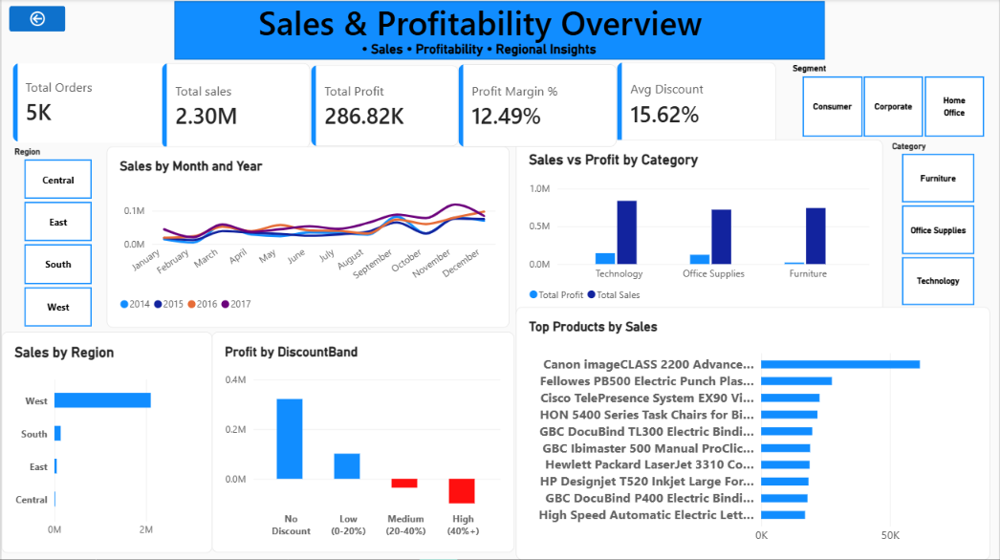
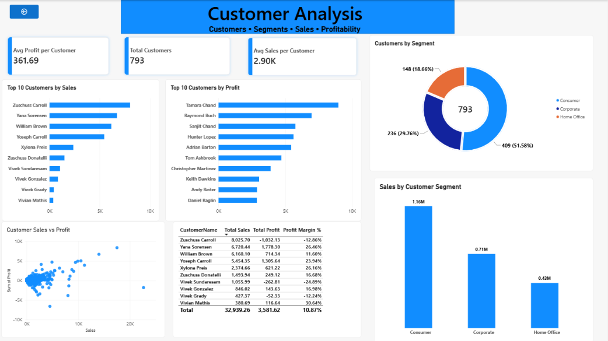

# Retail Sales & Customer Analytics — SQL, Python & Power BI

An end-to-end data analytics project analyzing retail sales, customer behavior, discounting, and product/category profitability using the classic Superstore dataset.

The project follows a complete **SQL → Python → Power BI** analytics pipeline, transforming raw transaction data into validated insights and interactive business dashboards.

---

## Problem Statement

A retail business wants to understand what's actually driving profit — not just revenue — across products, categories, customers, regions, and discount policies.

This project analyzes nearly **10,000 retail transaction records** to answer:

1. Is revenue seasonal?
2. Does discounting affect profitability?
3. Which products and categories generate healthy margins?
4. Are high-selling products always profitable?
5. How is sales performance distributed across regions?
6. Which customer segments and customers contribute most to sales and profit?

---

## Tools Used

- **SQL Server** — data cleaning, normalization, validation, and business analysis
- **Python** — Pandas, NumPy, Matplotlib, Seaborn
- **Jupyter Notebook** — EDA and data visualization
- **Power BI** — interactive dashboards and DAX measures
- **Git/GitHub** — version control and project management

---

## Project Structure

```text
retail-sales-analytics/
│
├── Data/              # Raw CSV and cleaned dataset
├── SQL/               # Schema, data loading, verification, and analysis queries
├── notebooks/         # Python EDA and visualization notebooks
├── Dashboard/         # Power BI file and dashboard screenshots
└── README.md
```

---

## **Dataset**

The project uses the classic Sample Superstore dataset containing nearly 10,000 US retail transaction records.
The dataset includes:
- Order details
- Customer information
- Product information
- Categories and sub-categories
- Regions
- Sales
- Quantity
- Discount
- Profit
- Order and shipping dates
Dataset Overview
- Original transaction rows: 9,994
- Valid transaction rows after cleaning: 9,993
- Distinct orders: 5,009
- Unique customers: 793
Transaction rows and orders are different metrics because a single order can contain multiple product records.

## **Data Cleaning & Data Quality Issues Found**
Several data quality issues were identified and handled during the SQL and Python phases.
1. NULL Profit Value
One row contained a NULL profit value:
- Order ID: CA-2017-168389
- Customer: Darrin Van Huff
Since this affected only 1 of 9,994 rows, the record was documented and excluded rather than imputing a financial value.
This resulted in 9,993 valid transaction rows being used for analysis.
2. Duplicate Customer Records
Some CustomerIDs appeared multiple times with conflicting City/State combinations across different orders.
This initially violated the intended PRIMARY KEY constraint on the normalized Customers table.
The issue was resolved using GROUP BY with MAX() as a deterministic tie-breaker rather than relying on a plain DISTINCT.
3. Column Type Misdetection During Import
SQL Server's import wizard initially detected the Profit column as NOT NULL, causing an insert failure.
The column definition was corrected to allow NULL values before re-importing the data.

## **SQL Data Model**
The transaction data was organized into a normalized relational structure consisting of three main tables:
Customers
    │
    │ CustomerID
    ▼
  Orders
    │
    ├── CustomerID
    │
    └── ProductID
             │
             ▼
          Products
Customers
- CustomerID
- CustomerName
- Segment
- Location attributes
Products
- ProductID
- ProductName
- Category
- SubCategory
Orders
- OrderID
- OrderDate
- ShipDate
- CustomerID
- ProductID
- Sales
- Quantity
- Discount
- Profit

## **SQL Analysis — Key Findings**
1. Revenue Is Seasonal
Revenue consistently peaks during November and December across the years in the dataset, with a noticeable decline during January and February.
November 2017 recorded the highest monthly revenue in the dataset.
This indicates a clear seasonal pattern in sales performance.

2. Higher Discounts Are Associated With Lower Profitability
Average profit per order decreases substantially as discount levels increase.
Discount Band	Orders	Avg Profit / Order
No Discount	4,798	+$66.90
Low (0–20%)	3,803	+$26.50
Medium (20–40%)	460	-$77.86
High (40%+)	932	-$106.37
Medium and high discount bands show negative average profit per order, while no-discount and low-discount orders remain profitable on average.
This is one of the strongest profitability patterns identified in the dataset.

3. High Sales Don't Guarantee High Profit
Product-level analysis shows that revenue alone is not enough to evaluate product performance.
The Canon imageCLASS 2200 Advanced Copier is among the strongest performers in terms of both sales and profit.
In contrast, products such as:
- Cisco TelePresence System EX90 Videoconferencing Unit
- GBC DocuBind P400 Electric Binding System
- High Speed Automatic Electric Letter Opener
generate substantial sales but show poor or negative profitability.
This demonstrates why sales volume should be evaluated alongside profitability.

4. Furniture Has a Margin Problem
Furniture generates substantial sales but has significantly lower profitability compared with the other categories.
Category	Sales	Profit	Avg Profit Margin
Technology	$836,154	$145,455	15.6%
Office Supplies	$719,047	$122,490	13.8%
Furniture	$741,278	$18,871	3.9%
Furniture generates approximately $741K in sales, but its average profit margin is only 3.9%, compared with 15.6% for Technology and 13.8% for Office Supplies.
This highlights the need to investigate pricing, discounting, product mix, and cost structure within the Furniture category.

5. Sales Are Concentrated in the West Region
The West region contributes approximately $2.1M in sales, making it the largest contributor among the regions in the analysis.
This highlights a significant regional concentration that can be investigated further when evaluating geographic performance and growth opportunities.

## **Python Analysis**
Python was used to validate the SQL findings, perform exploratory data analysis, engineer additional features, and visualize important patterns.
Feature Engineering
The analysis created additional features including:
- OrderYear
- OrderMonth
- ShippingDelayDays
- ProfitMargin
Additional Insights
Shipping delay showed limited impact on profitability.
Average profit margins remained broadly within the 10–15% range across shipping delays of 0–7 days, suggesting that shipping delay was not a major profitability driver in this dataset.
Profit Margin Distribution
The order-level profit margin distribution contains a long left tail of loss-making orders.
- Mean profit margin: ~12%
- Median profit margin: ~27%
The difference is influenced by extreme loss-making orders.

## **Power BI Dashboard**
The final Power BI dashboard contains two interactive pages connected to the SQL-based dataset.

### **1. Sales & Profitability Overview**

The first page provides an overview of overall business performance.
Key KPIs
- Total Orders: 5,009 distinct orders
- Total Sales: $2.30M
- Total Profit: $286.82K
- Profit Margin: 12.49%
- Average Discount: 15.62%
Dashboard Includes
- Monthly sales trend by year
- Sales vs. profit by category
- Sales by region
- Profit by discount band
- Top 10 products by sales
- Segment filter
- Category filter
- Region filter
### **Dashboard Preview**


 
### **2. Customer Analysis**

The second page focuses on customer-level sales and profitability.
Key KPIs
- Total Customers: 793
- Average Profit per Customer: $361.69
- Average Sales per Customer: $2.90K
Dashboard Includes
- Customers by segment
- Top 10 customers by sales
- Top 10 customers by profit
- Customer Sales vs. Profit analysis
- Customer-level Sales, Profit, and Profit Margin
- Sales by customer segment
### **Dashboard Preview**


## **Business Recommendations**

Based on the analysis, several areas can be investigated further:

### **1. Review High-Discount Orders**
Medium and high discount bands show negative average profit per order.
Discounting policies, particularly discounts above 20%, should therefore be reviewed before being applied broadly.

### **2. Investigate Furniture Profitability**
Furniture generates significant sales but has the lowest category-level profit margin.
Pricing, discounting, product mix, and cost structure should be investigated to understand the margin gap.

### **3. Review Loss-Making High-Sales Products**

Products generating high sales but negative profit should be investigated individually.
Potential areas include:
- Pricing
- Discounting
- Product costs
- Product mix

### **4. Evaluate Regional Concentration**
The strong contribution from the West region provides a reason to investigate sales performance and growth opportunities across the other regions.

## **End-to-End Analytics Workflow**
Raw Superstore Dataset
          ↓
      SQL Server
          ↓
Data Cleaning & Normalization
          ↓
   SQL Business Analysis
          ↓
       Python EDA
          ↓
Data Validation & Feature Engineering
          ↓
  Python Visualization
          ↓
    Power BI Dashboard
          ↓
    Business Insights

## **How to Reproduce**
Step 1 — Load the Dataset
Import the raw Superstore CSV from /Data into SQL Server as a staging table.
Step 2 — Create the Database Schema
Run:
/SQL/schema.sql
This creates the normalized Customers, Products, and Orders tables.
Step 3 — Load the Data
Run:
/SQL/load_data.sql
to populate the database.
Step 4 — Verify the Data
Run:
/SQL/verify.sql
to check:
- Row counts
- NULL values
- Duplicate records
- Data integrity
Step 5 — Run Business Analysis
Run:
/SQL/queries.sql
to reproduce the core SQL analysis.
Step 6 — Run Python EDA
Open:
/notebooks/01_eda_and_cleaning.ipynb
to reproduce:
- Data cleaning
- Data validation
- Feature engineering
- Exploratory analysis
Step 7 — Run Data Visualization
Open:
/notebooks/02_data_visualization.ipynb
to reproduce the Python visualizations.
Step 8 — Explore the Power BI Dashboard
Open:
/Dashboard/Retail_Sales_Customer_Analytics.pbix
using Power BI Desktop.
The .pbix file is included in the repository for downloading and exploring the interactive dashboard.

# **Key Takeaways**
This project demonstrates an end-to-end approach to transforming raw transactional data into business insights using:
SQL → Python → Power BI

The analysis highlights:
- Revenue has strong seasonal behavior, with November and December showing higher sales.
- Higher discount levels are associated with lower profitability.
- High sales do not necessarily translate into high profit.
- Furniture has substantially lower margins than Technology and Office Supplies.
- Sales are highly concentrated in the West region.
- Shipping delay shows limited relationship with profitability.
- Customer-level analysis provides additional insight beyond overall sales performance.

## **Skills Demonstrated**

### **SQL**
- Database Design
- Data Normalization
- Data Cleaning
- Data Validation
- Joins
- Aggregations
- GROUP BY
- CASE Statements
- Business Analysis Queries

### **Python**
- Pandas
- NumPy
- Matplotlib
- Seaborn
- Exploratory Data Analysis
- Feature Engineering
- Data Visualization

### **Power BI**
- Data Modeling
- DAX Measures
- KPI Cards
- Slicers & Filters
- Interactive Visualizations
- Sales & Profitability Analysis
- Customer Analysis

### **Tools**
- SQL Server Management Studio
- Jupyter Notebook
- Power BI Desktop
- Git
- GitHub

## **Project Summary**
Retail Sales & Customer Analytics
An end-to-end analytics project built to demonstrate the ability to work with real-world transactional data, perform data cleaning and analysis, validate findings using Python, and communicate business insights through an interactive Power BI dashboard.

**Tech Stack:**

`SQL Server` · `Python` · `Pandas` · `NumPy` · `Matplotlib` · `Seaborn` · `Power BI` · `DAX` · `Git` · `GitHub`

⭐ If you found this project useful or interesting, feel free to explore the repository and Power BI dashboard.

